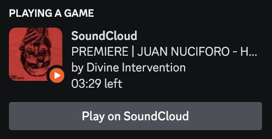
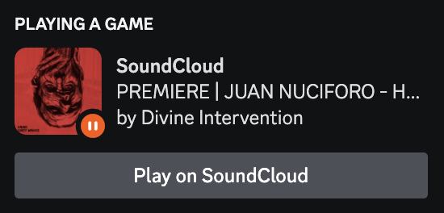

# soundcloud-live-rpc - A Soundcloud client with Discord Rich Presence live support

## Preview

## Installation
<!-- installation -->
Before installing and running this app, you must have Node.js installed on your machine. If you don't have Node.js installed, you can download it from the official website: [Node.js](https://nodejs.org/)

## Usage
<!-- usage -->
1. Clone this repository to your local machine.
2. Clone the `.env.example` and rename it `.env`.
3. Log in to your Discord developer portal and create a simple application.
4. Copy the Application ID and replace `YOUR_CLIENT_ID` inside the `.env`
5. Run `npm install` to install the required dependencies.
6. Run `npm start` to launch the application.
7. Log in to your Discord account to start displaying the currently playing SoundCloud track as your status.

## Credits
<!-- credits-->
- This project was enhanced from the original repository [https://github.com/richardhbtz/soundcloud-rpc](Richardhbtz-Soundcloud-RPC)
- The Discord Rich Presence integration is implemented using the [https://www.npmjs.com/package/discord-rpc](discord-rpc) package.
- The Electron window is created using the [https://www.electronjs.org/](Electron) framework.
- The executable is packed using [https://www.electron.build/](electron-builder).

## License
This project is licensed under the MIT License. See the [LICENSE](https://github.com/Maghwyn/soundcloud-live-rpc/blob/main/LICENSE) file for details.
